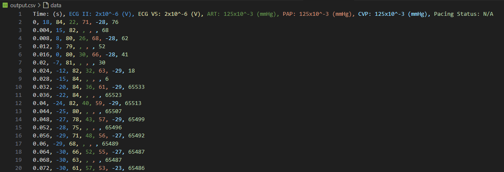

# MONK - MFER Library

A library for management of Nihon-Kohden MFER data, eventually with python bindings.

As of this commit, running the program will take an input MWF file, print the data & header, and write the formatted data in a csv, categorized by channel & ordered by time.



## Building & running the application

### Prerequisites

- g++
- CMake

#### For graphing script (graph.py)

- python
- pandas
- plotly
- pyarrow

### From command-line

#### Compile

Create a directory called build in the project root directory

Inside the build directory, run cmake on the project directory:
```
cmake ..
```
Then build the project with:

```
make
```

Compiles the application to Library.app.

#### Running the executable

```
./Library.app -i {input-file} -o {output-file}
```

Runs the application with a given file. (`./Library.app -i ./test-file.MWF -o ./output.csv` for example)

### Other CMake rules

```
rm -rf build/
```
Then repeat earlier steps to make a new build.

